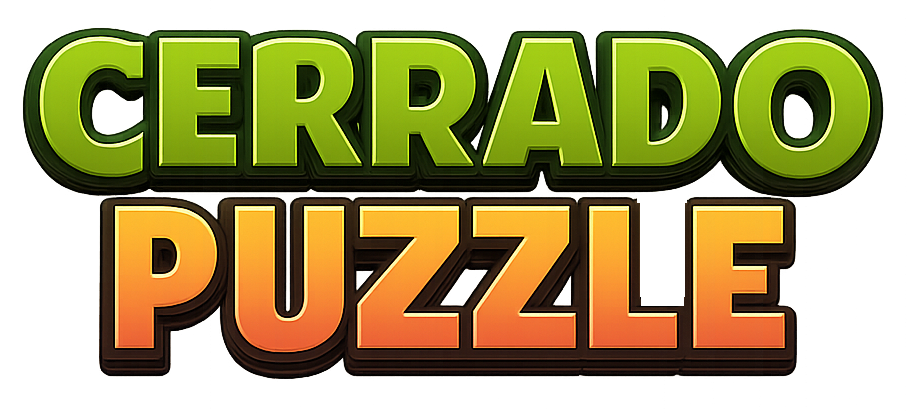
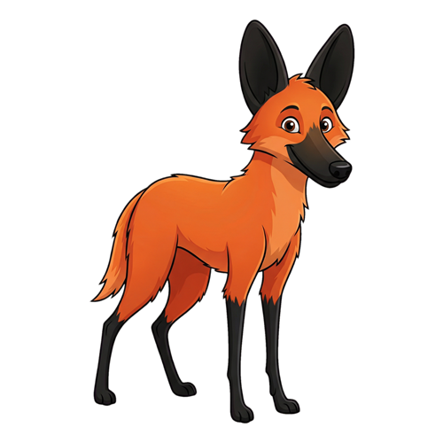
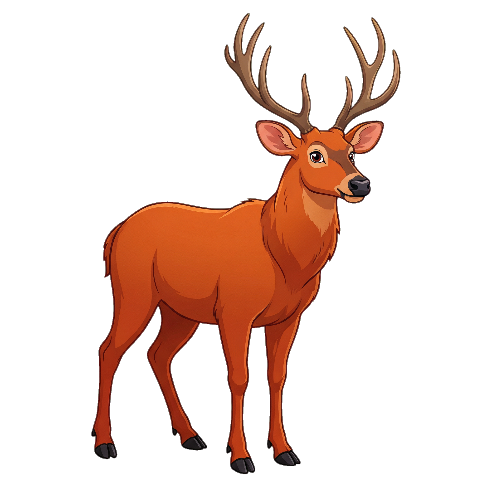
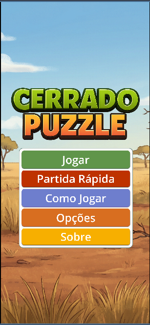
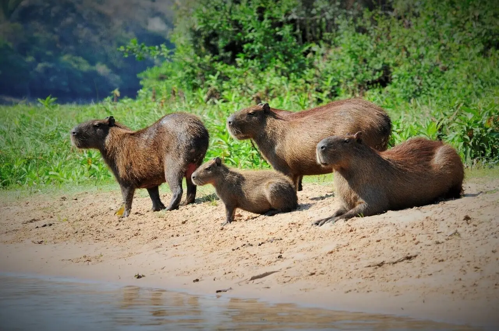

# 🧩 Cerrado Puzzle



**Cerrado Puzzle** é um jogo de quebra-cabeça 2D minimalista e educativo, desenvolvido com a **Godot Engine** (GDScript). O objetivo principal deste projeto é servir como um **template de jogo de escopo reduzido**, com uma lógica de fácil reprodução, ideal para desenvolvedores iniciantes que desejam publicar seu primeiro jogo.

## 🎮 Mecânica do Jogo

O jogo se passa em um tabuleiro de cards que exibem animais do cerrado brasileiro. A mecânica central é a **rotação de linhas e colunas inteiras**. O jogador deve girar o tabuleiro para alinhar pares de animais idênticos adjacentes (lado a lado ou um em cima do outro).



- **Objetivo:** Formar todos os pares de animais.
- **Progressão:** Sistema de estágios com dificuldade crescente (tamanho do grid e variedade de animais).
- **Score:** A pontuação final é baseada no número de movimentos; menos movimentos resultam em mais estrelas e um highscore melhor.

## 🚀 Tecnologias

- **Engine:** Godot Engine 4.x
- **Linguagem:** GDScript
- **Plataformas de Destino:** PC (Windows, Linux, macOS), Web (HTML5), Android

## ⚙️ Estrutura do Projeto

O projeto segue uma arquitetura modular para facilitar a manutenção e expansão:

| Arquivo/Módulo | Descrição |
| :--- | :--- |
| `scenes/` | Cenas principais do jogo (menus, gameplay, telas de vitória, etc.). |
| `scripts/` | Scripts GDScript que controlam lógica de jogo, UI e fluxo. |
| `scripts/GameBoard.gd` | Gerencia o grid, a lógica de rotação e a verificação de vitória. |
| `scripts/Card.gd` | Script individual de cada peça do puzzle. |
| `scripts/LevelManager.gd` | Define as configurações de cada estágio (tamanho do grid, animais). |
| `scripts/UIManager.gd` | Gerencia a interface do usuário (menus, HUD, transições). |
| `assets/backgrounds/` | Imagens de fundo usadas nas telas do jogo. |
| `assets/images/` | Capturas e imagens promocionais do gameplay. |
| `assets/info/` | Sprites e cards informativos dos animais do cerrado. |
| `assets/ui/` | Elementos de interface (logo, botões, ícones, etc.). |

## 🛠️ Como Executar o Projeto

### Pré-requisitos

1.  Instale a **Godot Engine 4.x** (versão estável).

### Instalação

1.  Clone este repositório:
    ```bash
    git clone https://github.com/seu-usuario/cerrado-puzzle.git
    ```
2.  Abra o Godot Engine.
3.  Clique em **Importar** e selecione a pasta `cerrado-puzzle`.
4.  Abra o projeto.
5.  Execute a cena principal (`Main.tscn`).


## 🎨 Assets Gráficos

Todos os assets gráficos (sprites de animais, ícones de UI, logo) foram gerados por inteligência artificial (Nano Banana). Eles estão disponíveis na pasta `assets/`.

### 🖼️ Galeria

| Tela inicial | Jogo em execução | Cartas e UI |
| :---: | :---: | :---: |
|  |  |  |

| Materiais de divulgação | Ícones de progresso | Animais do cerrado |
| :---: | :---: | :---: |
|  |  |  |

## 📝 Licença

Este projeto está licenciado sob a Licença MIT. Sinta-se à vontade para usar, modificar e distribuir o código.

## 🧑‍💻 Contribuições

Contribuições são bem-vindas! Se você encontrar um bug ou tiver uma sugestão de melhoria, por favor, abra uma *issue* ou envie um *pull request*.
